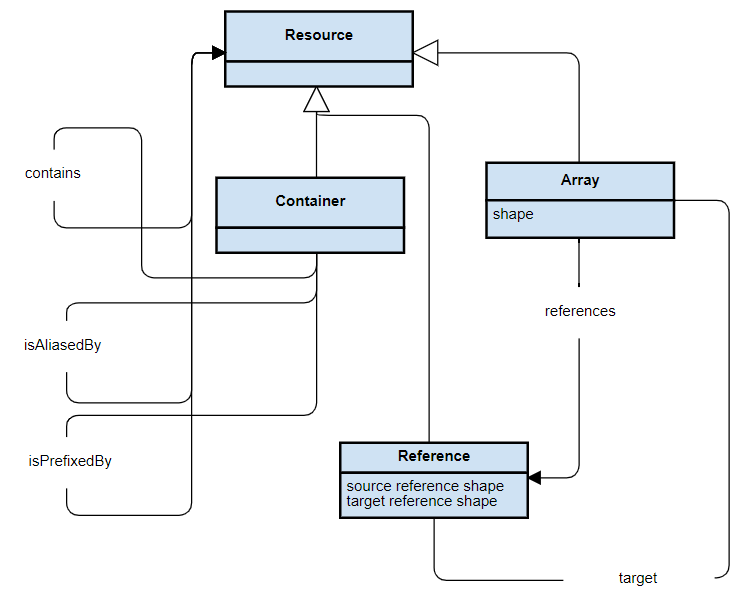

== Clauses not Containing Normative Material

=== Design principles and Rationale ===

netCDF-LD allows existing netCDF files to be interpreted as Linked Data with minimal changes. netCDF-LD encoding rules and mechanisms allow users to leverage Linked Data in programming environments using netCDF and to improve interoperability for netCDF files using different combinations of metadata conventions.

A design principle of netCDF-LD is that it works with existing netCDF encoded files. This means existing netCDF libraries can be used to parse files which have been encoded as netCDF-LD. This also ensures that netCDF-LD encoded files can be used as simply as netCDF, with no knowledge of RDF.

A key aspect of netCDF-LD is the introduction of rules for mapping identifiers for netCDF global and variable attributes and variables to Uniform Resource Identifiers (URIs) via _prefix_ and _alias_ mechanisms. Using these mechanisms, netCDF-LD provides a way to disambiguate attribute names and values shared among different netCDF files via identifiers. Identifiers are the building blocks for defining unambiguous semantics via concept definitions and relationships between concepts.

netCDF-LD aims to enable summary metadata from any netCDF file to be extracted to provide an external description of the file in RDF.  This enables references to externally published resources in RDF specifiy metadata conventions.  If desired, these descriptions can be used with other Linked Data technologies including the RDF query language, SPARQL (Harris and Seaborne 2013).

==== Motivating Scenarios

There are key objectives motivating this standard.

* To provide a mechanism for extracting the metadata of netCDF files and aggregating the extracted metadata.
* To enhance the clarity of metadata contained within netCDF files, which may implement multiple metadata conventions.


// For example .. ....   why I care

// interpret files and index contents


// extend conventions, with prefixes

// prefixes adding to aliases, stable content


=== Resource Description Framework

The _Resource Description Framework (RDF)_ is a W3C standard (Hayes and Patel-Schneider 2014).  Information elements consist of RDF statements. An RDF statement consist of three parts: _Subject_, _Predicate_, and _Object_. This is called a _triple_.

Identifiers are a key building block of RDF and _Uniform Resource Identifiers (URIs)_ are used to identify a resource. URIs can appear in each part of a triple, i.e. _Subjects_, _Predicates_ and _Objects_. Where an _Object_ is a _URI_, this may also be a subject for another statement.

Literals are another key part of RDF and are used to capture basic values other than a URI. e.g. strings such as "Gerald", dates such as "1 April 2019", and numbers such as "4897". Literals are associated with a datatype so that it can be parsed. Literals may only appear in the object part of a RDF statement. 

RDF statements are collected together within an _RDF Graph_. Figure 1 below show an example of an RDF graph encoding information about the singer B.B. King.

image::bb-king-rdf-example.png[Figure 1. RDF Example: BB king]

```
<B.B. King> <is a> <person>.
<B.B. King> <is born on> <the 16th of September 1925>. 
<B.B. King> <plays instrument> <guitar>
```

The netCDF-LD standard maps the netCDF data model encoding onto the RDF information model.


=== NetCDF File

The Unidata network Common Data Form (netCDF) is an interface for scientific data access and a freely-distributed software library that provides an implementation of the interface. The netCDF library also defines a machine-independent format for representing scientific data (https://github.com/Unidata/netcdf-c).

NetCDF is an encoding format with open semantics and inferred referencing.  Metadata may be defined on all variables and groups within a netCDF file, with each entity having it's own name space for locally unique attribute names and each attribute containing a single value.

For targeted metadata specification, such as defining referenced spatio-temporal coordinates, metadata conventions are used.

Metadata conventions and internal referencing enable a detailed representation of semantics describing the arrays of data values encoded within the file.

// example diagram from scitools

image::multi_array.png[Figure 2. Multi-dimensional Array]

image::multi_array_to_cube.png[Figure 3. Array with Arrays Defining Dimensions]

// variables

// references

// dimensions

// (one of the core issue to address in this specification is how to provide variable to variable referencing)


=== RDF Vocabularies

A set of RDF vocabularies are used within this standard.

A new vocabulary is defined by the Open Geospatial Consortium, the Binary Array Linked Data vocabulary: `bald` (https://www.opengis.net/def/binary-array-ld/). The `bald` vocabulary defines a small set of concepts which enable the structural elements of generic binary array containers, including netCDF, to be represented within an RDF graph. 

This standard also makes use of the core RDF vocabularies, the Dublin Core vocabulary,  the schema.org vocabulary and the Data Catalog Vocabulary (DCAT):

* rdf (http://www.w3.org/1999/02/22-rdf-syntax-ns#)
* rdfs (http://www.w3.org/2000/01/rdf-schema#)
* dct (http://purl.org/dc/terms/)
* sdo (http://schema.org)
* dcat (http://www.w3.org/ns/dcat#)





=== Metadata RDF Graph

An _RDF graph_ representing the metadata of multiple files provides a valuable resource for summarising the file collection.

The numerical data within the file is not encoded within the graph, only the metadata.  In general, this means that the graph is orders of magnitude smaller than the data file it summarises.

Having an _RDF graph_ of metadata across a file collection enables the use of Semantic Web technologies to explore, interrogate and visualise the metadata from that file collection in a variety of ways. In Figure 2, an example is given showing the CF standard name attribute value across multiple files.


image::images/metadata-across-files-example.png[Figure 2. Example showing cf:standard_name property values across different files.]

Representing this and other metadata enables queries across netCDF files, e.g. show me netCDF files that has data values on  `sea_surface_temperature`.

The following sections of this standard define how to interpret a netCDF file as an RDF metadata graph.

Multiple graphs may be combined into a single multi-file metadata graph as long as individual file identity is unique across the multi-file metadata graph.

// ==== Processing Model

// indicative

// one identifier
// plus
// external aliases
// plus
// input file
// produces one rdf graph output

==== Uniform Resource Identifiers within netCDF files

At the core of this standard is the mechanism for encoding and interpreting Uniform Resource Identifiers (URIs) within netCDF files.

These URIs may be declared explicitly within the files, or interpreted from file metadata and external information sources.


==== Identity

In netCDF-LD, a _netCDF file_ has an identity.  This identity provides the mechanism to obtain the file.  As it is mutable, it is dependent on how the file is provided.  Two systems may provide an identical file, but in different ways, and hence use different identities.

An explicit identity, i.e. a URL or URI, may be provided during file interpretation (i.e. by netCDF-LD parsers).  If no identity is provided, a default identity, a local file URI, will be used.  A local file URI will always use the '/' forward slash as a separator, even on systems where local identifiers use back slash separators.

The identifier for the netCDF file is the identity of the root group, that is, the base entity within the netCDF file. This provides identity to the contents of the file. For this reason, this standard mandates that the identifier string will always terminate in a '/' character separator.  In this way the root group's identity is distinguished as a different conceptual entity from the file itself.

Two examples are provided below showing, a file URI from a location, via a URL, which also serves as a URI for that file (Example 1).  Example 2 shows the root group within that file may reuse the identity string, as a compound part, with the addition of the extra '/' character, there by differentiating itself from the file object identity. 

* Example 1. https://www.unidata.ucar.edu/software/netcdf/examples/test_hgroups.nc (the URI identity of the netCDF file object)
* Example 2. https://www.unidata.ucar.edu/software/netcdf/examples/test_hgroups.nc/ (the URI identity of the root group contained within that netCDF file object)

===== Variable Identity 

Each variable within that file has its own identity, that is defined relative to the file identity. The variable name is appended to the file identity and separated by a ``/`` to denote the variable identifier.

===== Variable Type Declaration

Each netCDF variable shall declare a type statement, and RDF triple of the form

----

<variableURI> rdf:type <type>

----

There are two recognised type identifiers within the standard. 

====== Array Variable Type Identifiers

If the variable contains an array data payload (which may be missing data) then the type shall be defined as bald:Array and shall include a statement defining the shape of the data payload array as a Literal encoded tuple of integer values, using bald:shape.

The shape Literal is the shape as defined and ordered within the netCDF file, using the numerical values of the dimensions to define the actual shape.

The names of dimensions within the netCDF file encoding are not stored within the metadata summary graph.

----

<variableURI> rdf:type bald:Array ;
              bald shape (1,1,16,9) .

----

====== Resource Variable Type Identifiers

If there is no array payload and the variable is single valued (which may be missing data) then the type shall be defined as bald:Resource.  

In the bald vocabulary, bald:Resource is the general type, bald:Array is a specialiasation of this type.


----

<variableURI> rdf:type bald:Resource .

----
 

===== Download URL

The identity is conceptually distinct from the resolvable location of a file.  This may be simply involve the appending of a '/' character to the location, but it can be more distinct.

As a bald:Container is a subclass of dcat:Distribution, DCAT is used to describe the file type and to provide an optional statement to specify the resolvable location of the file object, using dcat:downloadURL.

----
this: a bald:Container ;
 dcat:distribution [
 	a dcat:Distribution;
 	dcat:downloadURL <{}>;
 	dcat:mediaType [
 		a dct:MediaType;
 		dct:identifier "application/x-netcdf"
 	];
 	dct:format [
 		a dct:MediaType;
 		dct:identifier <http://vocab.nerc.ac.uk/collection/M01/current/NC/>
 	]
                 ].

----

netCDF-LD implementations shall enable the file location to be provided at run time, separate from the identity, to define where the file object may be obtained from.

netCDF-LD implementations shall not provide a dcat:downloadURL statement unless specified at run time.

==== Containment

bald:Container instances use a simple containment behaviour, provided by the `bald:contains` property to represent the containment of variables and groups within groups and files.

==== Prefix Definition

In netCDF-LD, the _prefix_ is a mechanism to encode explicit URIs from elements in the _netCDF file_. It is the most straightforward and the most powerful way of doing so. It has two parts: the first part is the declaration of a prefix (or a set of prefixes), the second part is the use of the prefix.

Prefixes are in wide use in a number of domains, including XML and RDF. They allow a URI to be expressed in a compact fashion that saves space, enhances human readability and can mitigate issues with reserved characters.

===== Prefix Declaration in File

Prefixes may be declared inside the file using a name-value-pair that associates a short name (e.g. `cf__`, `bald__`), with a URI.

The attributes defining prefixes shall be in a seperate netCDF group or variable, as attributes.

The prefixes group shall not be interpreted as part of the graph, it is used only in the interpretation of URIs, which will be encoded as explicit RDF prefixes in RDF encodings.

A single prefix declaration is an attribute and a value: the attribute name is the prefix name and the attribute value is the full URI for that prefix. e.g.

----
  bald__ = https://www.opengis.net/def/binary-array-ld/
----

The 'double underscore' character pair: `__` is used as an identifier and as the termination of the prefix; the double underscore is part of the prefix string within the netCDF file.

The double underscore is interpreted as a special character by this standard: the first use of a double underscore from the start of any string shall be interpreted as a prefixed entity and shall be unpacked into full URIs by aware software if a full URI is defined.

A prefix defined within a file shall only be used as a prefix if it ends in a double-underscore character pair, `__`.

Prefixes are applied across the file they are declared within.  A single dedicated group shall be used to contain all of the internally defined prefixes applied to that file.

The prefix group is optional.

If included the prefixes group shall be identified within the file by a single global attribute, using the attribute name `bald__isPrefixedBy`.

If included, the prefixes group shall include the `bald` prefix declaration.

The definition of multiple prefix resources within a single file is invalid in this standard. 
netCDF-LD implementations may choose to combine prefix collections in invalid cases, but no precendence is implied, and prefix conflict is unresolved. 
netCDF-LD implementations may treat this condition as a warning condition and as a validation error.


===== Externally Defined Prefixes

Prefixes may be defined at runtime, by providing parseable JSON-LD context files or contents.

Prefixes will be interpreted during parsing from all context files and internally defined prefixes in combination.

Prefixes in context files shall be defined as RDF prefixes in JSON-LD.  This means that there is no prefix separator within the JSON-LD context file.  The prefix, defined in the JSON-LD context file shall be interpreted as the prefix string appended by a double-underscore `__` within the netCDF-LD contextual interpretation.

For example, the prefix `bald` would be defined witin a JSON-LD context file as:
----
{'@context': {'bald': 'https://www.opengis.net/def/binary-array-ld/'}}
----
(JSON-LD)

The parsing library would interpret this as equivalent to the definition of a prefix within a file:

----
group: prefix_list {
    :bald__ = "https://www.opengis.net/def/binary-array-ld/" ;
    }
----
(CDL)

and thus match to attributes within the file, such as:
----
// global attributes:
                :bald__isPrefixedBy = "prefix_list" ;
----
(CDL)


===== Prefix Conflict

If a prefix string is defined multiple times in JSON-LD context files, with different URI interpretations, then implementations shall ignore that prefix and treat the prefix as locally unresolved.
Implementations may choose to raise warnings, validation errors, etc. in these cases.

It is expected that files will be able to be parsed, even if prefix conflicts exist. Conflict in prefix definitions is not a violation of this standard, the fallback position is to ignore conflicting prefixes as not well defined at runtime.

Prefix definitions provided explicitly within a file shall not be overwridden be context files.  Prefixes defined within a file have precedence.

If a prefix defined within a file is also defined within provided JSON-LD context files with different URI interpretations, then implementations shall ignore that JSON-LD context definition and treat the prefix as locally resolved.

This standard does not consider this as a parsing error.

Implementations may treat this condition as a warning condition and as a validation error within the provided context.


===== Prefix use

A prefix is used with netCDF file elements as:
----
  <prefix><name>
----

This is interpreted within this standard as a URI, a concatenation of the matching value within the prefix variable and the remainder of the attribute name or value.

The attribute name
----
  bald__isPrefixedBy
----
together with the prefix definition
----
  bald__ = https://www.opengis.net/def/binary-array-ld/
----
is interpreted as
----
  bald__isPrefixedBy = https://www.opengis.net/def/binary-array-ld/isPrefixedBy
----

Prefixes shall end in a URI separator, either a `/` or a `#`.  

The following example, in netCDF Common Data Language (CDL), uses the link:++binary-array-ld.net++[https://www.opengis.net/def/binary-array-ld] and the `w3.org rdf-syntax-ns` vocabularies to describe a reference relationship between two variables.

----
netcdf tmpMwXy8U {
dimensions:
	pdim0 = 11 ;
	pdim1 = 17 ;
variables:
	int a_variable(pdim0, pdim1) ;
		a_variable:rdf__type = "bald__Array" ;
		a_variable:bald__references = "b_variable" ;
	int b_variable(pdim0, pdim1) ;
		b_variable:rdf__type = "bald__Reference" ;
		b_variable:bald__array = "b_variable" ;

// global attributes:
		:bald__isPrefixedBy = "prefix_list" ;
group prefix_list {
    :bald__ = "https://www.opengis.net/def/binary-array-ld/" ;
    :rdf__ = "http://www.w3.org/1999/02/22-rdf-syntax-ns#" ;
}
}
----

In this example:

* `rdf__type` is interpreted as http://www.w3.org/1999/02/22-rdf-syntax-ns#type
* `bald__array` is interpreted as https://www.opengis.net/def/binary-array-ld/array


==== Alias Definition

Alongside the definition of prefixes, explicit aliases may be defined via netCDF-LD conventions within the _netCDF file_, or as a scope for a _netCDF file_ during parsing.  Aliases enable controlled attribute names to be interpreted as URIs.

Alias definitions do not exist with file CDL.  They are provided as input (either as RDF or JSON) to a parsing process at parse time, from external vocabularies.

Alias URIs are interpreted from a reverse lookup from the file into the graph.  As such name clashes are not protected against.

For an entity in an alias graph to be considered as an alias, the entity will define a RDF statement:

----
  <$entity> <http://purl.org/dc/terms/identifier> "$Literal" .
----

The Literal object of this RDF statement is the alias name.

An alias that may be used as an attribute name alias shall define its Type as

----
  <$entity> <http://www.w3.org/1999/02/22-rdf-syntax-ns#type> <http://www.w3.org/1999/02/22-rdf-syntax-ns#Property> .
----

or

----
  <$entity> <http://www.w3.org/1999/02/22-rdf-syntax-ns#type> <http://www.w3.org/2002/07/owl#ObjectProperty> .
----


The alias mechanism is less flexible than the prefix mechanism. It does enable interpretation of attribute names directly, making it useful for existing standards and existing files.

Aliases are applied across the file they are declared for.

Aliases are declared as a set of RDF graphs. These RDF graphs are commonly provided as URIs, to be obtained during parsing and file metadata interpretation.

The RDF graphs shall be combined and treated as a single alias scope for the file.

An example of alias definitions in an external file is shown below encoded as TTL as separate files for names.

----
# Names Aliases
@prefix dct: <http://purl.org/dc/terms/> .
@prefix skos: <http://www.w3.org/2004/02/skos/core#> .
@prefix acdd: <https://def.scitools.org.uk/ACDD/> .
@prefix cfterms: <https://def.scitools.org.uk/CFTerms/> .
@prefix nc: <https://def.scitools.org.uk/NetCDF/> .
<<<<<<< HEAD
@prefix op: <http://environment.data.gov.au/def/op#> .

acdd:id                 dct:identifier "id" .
acdd:title              dct:identifier "title" .
cfterms:standard_name   dct:identifier "standard_name" .
cfterms:units           dct:identifier "units" .
=======

skos:prefLabel          dct:identifier "prefLabel" .
acdd:id                 dct:identifier "id" .
acdd:title              dct:identifier "title" .
cfterms:units           dct:identifier "units" .
cfterms:standard_name   dct:identifier "standard_name" .
>>>>>>> 3bd50d44b39cd77c501d004caff04041f7f33e2d
nc:valid_min            dct:identifier "valid_min" .
nc:valid_max            dct:identifier "valid_max" .
op:matrix               dct:identifier "matrix" .
op:objectOfInterest     dct:identifier "substanceOrTaxon" .
<<<<<<< HEAD
skos:prefLabel          dct:identifier "prefLabel" .
----


The following shows the RDF example as a JSON-LD serialization:
----
{
  "@context": {
    "dct": "http://purl.org/dc/terms/",
    "xsd": "http://www.w3.org/2001/XMLSchema#",
    "acdd": "https://def.scitools.org.uk/ACDD/",
    "cfterms": "https://def.scitools.org.uk/CFTerms/",
    "nc": "https://def.scitools.org.uk/NetCDF/",
    "skos": "http://www.w3.org/2004/02/skos/core#",
    "op": "http://environment.data.gov.au/def/op#"
  },
  "@graph": [
    {
      "@id": "skos:prefLabel",
      "dct:identifier": "prefLabel"
    },
    {
      "@id": "acdd:id",
      "dct:identifier": "id"
    },
    {
      "@id": "acdd:title",
      "dct:identifier": "title"
    },
    {
      "@id": "cfterms:standard_name",
      "dct:identifier": "standard_name"
    },
    {
      "@id": "cfterms:units",
      "dct:identifier": "units"
    },
    {
      "@id": "op:matrix",
      "dct:identifier": "matrix"
    },
    {
      "@id": "op:objectOfInterest",
      "dct:identifier": "substanceOrTaxon"
    },
    {
      "@id": "nc:valid_max",
      "dct:identifier": "valid_max"
    },
    {
      "@id": "nc:valid_min",
      "dct:identifier": "valid_min"
    }
  ]
}
----

Alias definitions provided as input as a simple dictionary representation is available as JSON. The alias dictionary representation encoded as JSON shall consist of only an object with name/value pairs for the alias and the mapped URI respectively. The value for an item in the JSON object shall be a string value for the URI. 

An example of aliases for both names and values expressed as dictionary encoded as a JSON file is shown below:
----
{
        "id"                             : "https://def.scitools.org.uk/ACDD/id",
        "title"                          : "https://def.scitools.org.uk/ACDD/title",
        "standard_name"                  : "https://def.scitools.org.uk/CFTerms/standard_name",
        "units"                          : "https://def.scitools.org.uk/CFTerms/units",
        "valid_min"                      : "https://def.scitools.org.uk/NetCDF/valid_min",
        "valid_max"                      : "https://def.scitools.org.uk/NetCDF/valid_max",
=======
----


Example of aliases for both names and values captured in a JSON file:
----
{
        "id"                             : "https://def.scitools.org.uk/ACDD/id",
        "standard_name"                  : "https://def.scitools.org.uk/CFTerms/standard_name",
        "title"                          : "https://def.scitools.org.uk/ACDD/title",
        "units"                          : "https://def.scitools.org.uk/CFTerms/units",
        "valid_max"                      : "https://def.scitools.org.uk/NetCDF/valid_max",
        "valid_min"                      : "https://def.scitools.org.uk/NetCDF/valid_min",
>>>>>>> 3bd50d44b39cd77c501d004caff04041f7f33e2d
        "matrix"                         : "http://environment.data.gov.au/def/op#matrix",
        "substanceOrTaxon"               : "http://environment.data.gov.au/def/op#objectOfInterest"
        "prefLabel"                      : "http://www.w3.org/2004/02/skos/core#prefLabel"
}
----

==== Attribute Names

In order to map netCDF metadata to RDF, all global and variable attributes are interpreted as RDF statements.  This requires that all attribute names are interpreted as URIs.

A parsing process shall map attribute names to URIs using prefix definitions first, then map attribute names to URIs aliases.

An attribute name shall be mapped to an alias URI if, and only if, there is an exact match for the full attribute name as a `dct:identifier` (expand to full uri) for an entity within the alias graph where that entity declares a RDF statement within its defining graph.

----
  <entity> <rdf:type> <rdfs:ObjectProperty> .
----

That defining graph needs to be provided to netCDF-LD aware software at the time of parsing the file, so that it can be interpreted.

An error is thrown if multiple aliases match an attribute name in a _netCDF file_ due to a conflict in unambiguously identifying the declared alias scope.

All remaining attribute names shall be mapped to local identifiers, using the file identity and variable identity (`ref{}`) to form a locally applicable URI.

In the examples, the prefix `this:` is used within the graphs as the file identifier.

==== Variable-to-Variable References

The value of an attribute may be a reference to another variable, or multiple variables.
The process of establishing identity for each variable within the file enables this reference to be interpreted as a URI.
In this way, the RDF approach to having objects that are links to subjects, chaining RDF statements into graphs, is implemented.

For a reference to be identified, the predicate that defines that reference must identify itself as suitable for variable-to-variable referencing.  No references will be inferred for predicates that do not identify themselves in this way.

To identify a predicate as a variable-to-variable reference predicate, that predicate shall provide a RDF statement that explicitly opts into this behaviour.  The simplest way to do this is to include the RDF statement.

----
  <{predicate}> rdfs:range bald:Resource .
----


References to variables are implemented in netCDF files by defining the value of an attribute as the name of a variable, or as a space separated set of names of variables, or as a parenthesis bound space separated list of names of variables.

A set of references is explicitly unordered whilst a list of references is explicitly ordered.

CDL defining a set of references:
----
  int set_collection ;
    set_collection:bald__references = "data_variable1 data_variable2" ;
----

will be interpreted into RDF(turtle) as:
----
  ns1:set_collection a bald:Resource ;
      bald:references ns1:data_variable1_ref,
                      ns1:data_variable2_ref .
----


CDL defining a list of references:
----
  int list_collection ;
    list_collection:bald__references = "( data_variable1 data_variable2 )" ;
----

will be interpreted into RDF(turtle) as:
----
  ns1:list_collection a bald:Resource ;
      bald:references ( ns1:data_variable1 ns1:data_variable2 ) .
----

//All variable names shall be within the file, or no references shall be interpreted.  There shall be no partial matching.

If matching fails, the fall back option is to ignore the potential for references and leave the attribute value as a Literal.

==== Attribute Values

In RDF, objects may be Literals or URIs, therefore attribute values are conditionally interpreted as Literals or as URIs.
A parsing process shall map attribute values to URIs using identified prefixes first.

===== Attribute Variable References

The value of a variable attribute may be an internal reference to another variable within the file.

For an in file variable reference to be declared, three conditions shall be met.

* Condition one: the value is a string which exactly matches the name of a variable within the file.
** netCDF LD uses the rules for referencing variables across groups defined by the CF Conventions for netCDF Files:
*** (http://cfconventions.org/cf-conventions/cf-conventions.html#groups);
*** 'search by absolute path' and 'search by relative path' shall be implemented;
*** 'search by proximity' is deprecated by CF, and may be implemented or not.
* Condition two: the attribute name is already interpreted as a URI, defining an entity, external to the file.
* Condition three: the attribute name entity declares and `<rdfs:range>` of `<bald:Resource>`.

An identified attribute reference shall map the attribute value to the identify of the matched variable within the file.

This identification takes place after prefixes are identified and mapped.

===== Attribute Value Aliases

After prefix and reference interpretation, remaining attribute values are mapped to URIs using the alias graph.

An attribute value shall be mapped to an alias URI if and only if there is an exact match for the full attribute value as a `dct:identifier` (expand to full uri) for an entity within the alias graph.

If multiple aliases match an attribute name, this is an error condition, the declared alias scope cannot be uniquely applied to the file.

===== Attribute Value Literals

All remaining attribute values shall be left unchanged and declared as instances of `<rdf:Literal>`.


=== NetCDF Dimensions

NetCDF makes strong inferences regarding how variables are defined by dimensions.

NetCDF files define named dimensions, `dims`.  Each dimension defines a size, which is used as an array dimension.  NetCDF Variables use dimensions to define their size and shape and to define some implicit references between each other.

In this way the netCDF variables are defined with respect to shared dimensions.

image::multi_array.png[Figure 2. Multi-dimensional Array]

image::multi_array_to_cube.png[Figure 3. Array with Arrays Defining Dimensions]

NetCDF-LD uses the dimensions to interpret the size and shape of a variable array.

NetCDF-LD does not explicity encode the dimensions: only the sizing and referencing information.  In cases where dimensions do not have a netCDF coordinate variable defined, this results in the name of the dimension being lost.

Extensive Variables are variables defined with respect to one or more dimensions.

In netCDF-LD, the size and shape of each extensive variable is explicitly stored as a RDF statement made with respect to that variable.  The predicate bald:shape is used.  Objects of this predicate shall be `rdf:Literal` instances.

Each extensive variable shall be described by a RDF statement.

----
  <$entity> <https://www.opengis.net/def/binary-array-ld/shape> ($d0 $d1 $d2)
----

where `$dn` is an integer, taken from the defined dimension size in the netCDF file and the count of the number of values is the dimensionality of the variable.

The object of this statement is an RDF List.

==== Broadcasting

In order to interpret netCDf dimensions within RDF graphs, the concept of Broadcasting is presented here, and used to implement array referencing.

Broadcasting enables array which share some dimensions, but have different overall dimensionality, to be interpreted together.  Two arrays may be broadcast if the dimensions they share are ordered the same and extra dimensions can be interpted unambiguously.

The result of broadcasting is an array shape which can represent the contents of each of the two input arrays, with extra dimensions comtaining copies of the defined values.  In other words, an array may be stretched 

In this way an array location in the broadcast result array can interpret one and only one value from each of the input arrays.

The concept of broadcasting defined in the Python Numpy library https://numpy.org/devdocs/user/theory.broadcasting.html, where some of these images and descriptions are sourced from.

image::theory.broadcast_1.gif[]

image::theory.broadcast_2.gif[]

image::theory.broadcast_3.gif[]

image::theory.broadcast_4.gif[]

==== Shape and Reshape

In order to describe the results of the broadcast concepts in an implementation neutral fashion, this standard uses the shape and the concept of reshape.

The shape of an array is an ordered list of integers, representing the dimensionality of a multi-dimensional array and the size of each dimension.

Reshape is an operation which changes the dimensionality of an array, whilst preserving the number of values within the array.

Any array shape may be reshaped by adding elements to the array shape list, where the added items are of size 1.  In situ elements of the shape that are not size 1 may not be reordered by a reshape.

For example:

----
bald:sourceShape (5, 9)
bald:sourceReshape (1, 1, 5, 9, 1)
----


==== Variable References and Dimensions

NetCDF-LD uses the defined netCDF dimensions to interpret references between variables and to interpret how the shapes of the variable arrays relate.

Each variable reference between variables defined with respect to netCDF dimensions is assumed to be an array-to-array relationship and that the arrays can be broadcast to enable a common indexing approach.

Broadcast is defined as extending an array along each of a set of defined dimensions, each of size 1, by copying the contents of the array for each array index up to the defined size.  This enables an array to match shape with another array. 

This interpretation means that it can be expected that the target in the reference relationship can be viewed with a consistent dimensionality to the source.  A reshape shape is defined for the source and target, with size one values for dimensions that are to be broadcast over.  This imposes dimension ordering for the broadcast operation.

Note: this is a key feature of netCDF dimensions: defining the size and commonality of array dimensions for variables.

In each case where a variable-to-variable reference is inferred within a netCDF file and both of the variables are defined with respect to one or more dimensions, the nature of that reference from the perspective of the arrays will be explicitly encoded within the RDF graph.

The inferencing of how array dimensions are matched and how this enables the interpretation of array broadcasting is subtle and implicit in netCDF, and specific to netCDF.

This information is unpacked and stored in a general fashion within the RDF graph.

All extensive variables have a shape encoded in the RDF graph.  In order to interpret references, it is commonly required that a RDF statement, similar to the shape, is encoded, showing the reshaped shape that an array needs to be in order to properly broadcast.
NetCDf-LD explicitly includes all reference RDF statements, even where the broadcast relationship can be inferred, for clarity and to aid comprehension.

A reshape array has the same total number of elements as the original array, but includes extra dimensions, of size 1, defining the order which the extensive dimensions are handled in.

To hold this information, netCDF-LD creates a new entity within the graph, representing this relationship, a `<$referenceEntity>`.

This `<$referenceEntity>` is referenced by the `<$sourceEntity>` using the predicate `<https://www.opengis.net/def/binary-array-ld/references>`, i.e.:

----
  <$sourceEntity> <https://www.opengis.net/def/binary-array-ld/references> <$referenceEntity>
----

The `<$referenceEntity>` is defined to be of type `<https://www.opengis.net/def/binary-array-ld/Reference>` and shall define a single statement defining the target entity in the relationship, another variable in the file, using the predicate `bald:target`. The `<$referenceEntity>` shall define a `bald:targetShape` statement defining the reshape expansion of the target array.
The `<$referenceEntity>` may  define a `bald:sourceShape`, where that source shape is required to be different from the defining shape of the source array.
The `<$referenceEntity>` shall  define a `bald:sourceShape`, whether that source shape is required to be different from the defining shape of the source array or whether the shape is the same.

In this manner, the source array and the target array are defined in a common dimensionality enabing the shape to be unambiguously defined for broadcasting; i.e.:

----
  <$referenceEntity> a <https://www.opengis.net/def/binary-array-ld/Reference> ;
      <https://www.opengis.net/def/binary-array-ld/sourceShape> ($d1 $d2 $d3) ;
      <https://www.opengis.net/def/binary-array-ld/targetShape> ($d4 $d5 $d6) ;
      <https://www.opengis.net/def/binary-array-ld/target> <$targetEntity> .
----

`$dn` are all defined to be integers.  The object of these RDF statements are each an RDF list.

The object of the `bald:sourceShape` statement and `bald:targetShape` shall be an RDF list with equal numbers of elements.


===== Mismatched reference 

Where metadata schemes provide further variable reference predicates, it is possible for variable-to-variable references to be defined where a broadcast relationship does not exist.

Applications may treat mismatches between reference definitions and the ability to broadcast as warning conditions, and skip the creation of RDF statements. In this case, it is recommended to continue to create a graph and omit references.  It is accepted that an implementation may treat this as an error condition, and fail to create a graph.  This is an implementation detail.

==== NetCDF Coordinate Variables

NetCDF defines a special type of variable, called a _Coordinate Variable_, which is identified by being one-dimensional and having the same name as the single dimension used to size the variable.

NetCDF-LD interprets Coordinate Variables as a case of variable referencing and includes entries as `bald:references` statements. 

NetCDF-LD adds information on the Coordinate Variables, providing the first value, and optionally the last value, if there is more than one value.  The first and last are taken from the order as presented within the file. If the value is encoded as a missing value, then no statement is included within the metadata graph.

NetCDF-LD uses the terms `bald:arrayFirstValue` and `bald:arrayLastValue` to identify these extracts from the Coordinate Data payload within individual statements in the resulting graph.

In this way, searchable information on the location in geospatial and conceptual coordinate space is extracted from the files, whilst the graph size increases by two statements per coordinate variable.  The full coordinate array is not encoded within the metadata graph.

==== Worked Example

Here the definition of a netCDF file, in CDL, with all data array elements set as missing, is presented. It is followed by an RDF graph interpretation of the netCDF, illustrating many of the interpretation features desribed in this chapter.

----
netcdf tmpMwXy8U {
dimensions:
	pdim0 = 11 ;
	pdim1 = 17 ;
variables:
	int data_variable1(pdim0, pdim1) ;
		data_variable1:bald__references = "location_variable" ;
		data_variable1:long_name = "Gerald";
		data_variable1:obtype = "metce__SamplingObservation";

        int data_variable2(pdim0, pdim1) ;
		data_variable2:bald__references = "location_variable" ;
		data_variable2:long_name = "Imelda";
		data_variable2:obtype = "metce__SamplingObservation";

        int pdim0(pdim0) ;

        int pdim1(pdim1) ;

	int location_variable(pdim0, pdim1) ;
		location_variable:bald__references = "location_reference_system" ;

	int location_reference_system;
		location_reference_system:pcode = "4897";

	int set_collection ;
	        set_collection:bald__references = "data_variable1 data_variable2" ;

	int list_collection ;
	        list_collection:bald__references = "( data_variable1 data_variable2 )" ;

// prefix group
group: prefix_list {
  :bald__ = "https://www.opengis.net/def/binary-array-ld/" ;
  :metce__ = "http://codes.wmo.int/common/observation-type/METCE/2013/" ;
  :rdf__ = "http://www.w3.org/1999/02/22-rdf-syntax-ns#" ;
}
// global attributes:
		:_NCProperties = "version=1|netcdflibversion=4.4.1|hdf5libversion=1.8.17" ;
		:bald__isPrefixedBy = "prefix_list" ;

}

----

According to this standard, the netCDF file as defined above is interpreted into RDF, in the terse triple language (TTL) as

----
@prefix bald: <https://www.opengis.net/def/binary-array-ld/> .
@prefix dcat: <http://www.w3.org/ns/dcat#> .
@prefix dct: <http://purl.org/dc/terms/> .
@prefix metce: <http://codes.wmo.int/common/observation-type/METCE/2013/> .
@prefix rdf: <http://www.w3.org/1999/02/22-rdf-syntax-ns#> .
@prefix rdfs: <http://www.w3.org/2000/01/rdf-schema#> .
@prefix this: <file://CDL/multi_array_reference.cdl/> .
@prefix xml: <http://www.w3.org/XML/1998/namespace> .
@prefix xsd: <http://www.w3.org/2001/XMLSchema#> .

this: a bald:Container ;
    dct:format [ a dct:MediaType ;
            dct:identifier <http://vocab.nerc.ac.uk/collection/M01/current/NC/> ] ;
    dcat:distribution [ a dcat:Distribution ;
            dcat:mediaType [ a dcat:MediaType ;
                    dct:identifier "application/x-netcdf" ] ] ;
    bald:contains this:data_variable1,
        this:data_variable2,
        this:list_collection,
        this:location_reference_system,
        this:location_variable,
        this:pdim0,
        this:pdim1,
        this:set_collection ;
    bald:isPrefixedBy "prefix_list" .

this:list_collection a bald:Resource ;
    bald:references ( this:data_variable1 this:data_variable2 ) .

this:pdim0 a bald:Array ;
    bald:shape ( 11 ) .

this:pdim1 a bald:Array ;
    bald:shape ( 17 ) .

this:set_collection a bald:Resource ;
    bald:references this:data_variable1,
        this:data_variable2 .

this:location_reference_system a bald:Resource ;
    this:pcode "4897" .

this:data_variable1 a bald:Array ;
    this:long_name "Gerald" ;
    this:obtype metce:SamplingObservation ;
    bald:references this:location_variable ;
    bald:shape ( 11 17 ) .

this:data_variable2 a bald:Array ;
    this:long_name "Imelda" ;
    this:obtype metce:SamplingObservation ;
    bald:references this:location_variable ;
    bald:shape ( 11 17 ) .

this:location_variable a bald:Array ;
    bald:references this:location_reference_system ;
    bald:shape ( 11 17 ) .

----


=== NetCDF Linked Data on Schema.org ===

This standard recognises that while domain specific vocabularies and detailed RDF representations of datasets in NetCDF are important, there is a growing movement to make use of standardised vocabularies, such as Schema.org, to harmonise the higher-level descriptions of digital assets such as datasets. The goal of this activity is often the promotion of datasets in portals through Search Engine Optimisation and also to provide a common syntax and understanding of the datasets in a consistent language.

To this end, NetCDF-LD also supports a limited description of a netCDF file as Schema.org Dataset through mapping a bald:Container to the Schema.org Dataset class. 

Within the Schema.org representation, the DCAT usage to describe the file type and to provide an optional statement to specify the resolvable location of the file object described above is mapped to Schema.org's DataDownload class and its associated properites.

image::images/netcdf_ld_as_schema_dot_org.png

A worked example follows in RDF, encoded using the terse triple language (TTL):

----

@prefix so: <http://schema.org/> .

<https://www.ngdc.noaa.gov/thredds/dodsC/arctic/Polar-APP-X_v01r01_Nhem_1400_d20160801_c20160803.nc> a so:Dataset;
	so:name "Extended AVHRR Polar Pathfinder Fundamental Climate Data Record (APPx CDR)" ;
	so:description "The Extended AVHRR Polar Pathfinder (APP-x) version-2 Thematic Climate Data Record (CDR) includes surface temperature, surface albedo, surface and the Top Of the Atmosphere (TOA) shortwave and longwave radiative fluxes, cloud properties (amount, phase, particle size, optical depth,top pressure and temperature, surface and TOA radiative effect), and ice thickness and age. The APP-x CDR has twice daily data at local solar times of 14 and 04(02) for the Arctic(Antarctic) at a spatial resolution of 25 km for both poles." ;
	so:identifier "Polar-APP-X_v01r01_Nhem_1400_d20160801_c20160803.nc" ;
	so:keywords:
        "EARTH SCIENCE > ATMOSPHERE > ATMOSPHERIC RADIATION > RADIATIVE FLUX",
        "EARTH SCIENCE > TERRESTRIAL HYDROSPHERE > SNOW and ICE > ALBEDO" ;
	so:license "No restrictions on access or use" ;
	so:url <https://www.ngdc.noaa.gov/thredds/dodsC/arctic/Polar-APP-X_v01r01_Nhem_1400_d20160801_c20160803.nc/>;
	so:distribution [
		a so:DataDownload ;
		so:contentUrl <https://www.ngdc.noaa.gov/thredds/dodsC/arctic/Polar-APP-X_v01r01_Nhem_1400_d20160801_c20160803.nc/> ;
		so:encodingFormat "application/x-netcdf", "http://vocab.nerc.ac.uk/collection/M01/current/NC/"
	] .
	
----

=== Implementation Adaptions ===

This standard recognises that there are myriad opportunities for optimisation of large collections of graphs of netCDF files contents.

For example, a series, or collection of netCDF files may share the vast majority of metadata, differing in only one or two key elements, such as a different value for a temporal coordinate, along with different data values.

Implementations may implement many different strategies, reducing the volume of data stored, constructing shared entities to aid query construction or optimisation.

As this standard is targeted at standardising the representation of a single file, it is important that a method for validating consistency is provided which does not preclude useful optimisation steps.

On this basis, it is suggested that an implementation may provide a transformation, such that the graph for an individual file may be derived from a compressed or engineered storage format.

The data storage shall be deemed compliant with this standard if a graph representing a single file may be transformed by the provided transformation into a single file graph that meets the validation rules within this standard.

The format for such transformations is not specified by this standard, it need only provide a suitable RDF graph output.
